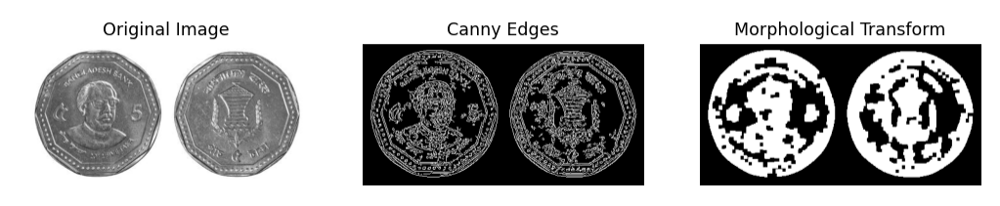
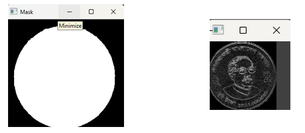
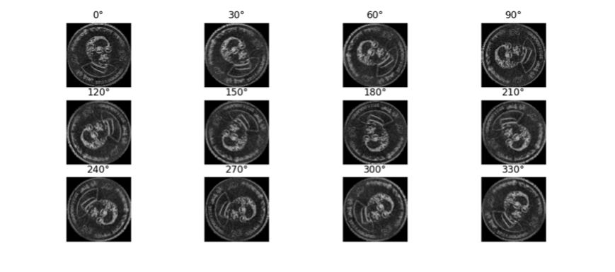
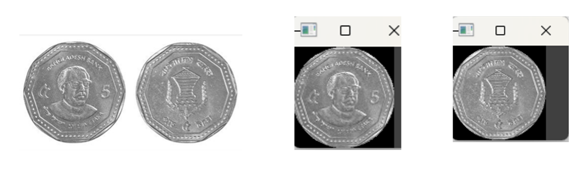
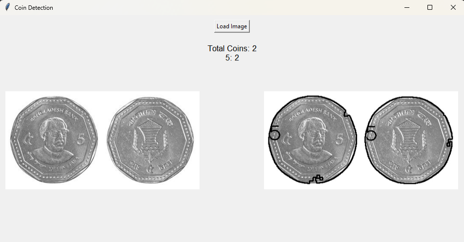

# Bangladeshi Coin Detection Using Template Matching

## Introduction
This project implements coin detection and classification using template matching techniques. The primary goal is to detect and classify coins based on their visual characteristics from an input image.

## Objectives
- Identify and classify different types of coins based on visual features.
- Understand the fundamentals of coin detection.
- Implement image processing techniques to detect and label coins.
- Evaluate the accuracy of template matching under varying orientations.

## Methodology
### 1. Image Preprocessing
- Convert the grayscale image to a binary image using thresholding.
- Apply morphological operations to clean and enhance the binary image.
- Detect contours to identify potential coin candidates.

**Preprocessed Image:**

### 2. Template Matching
- Use template images of coins and compare them with the detected coin candidates.
- Rotate the template images to match coins at various orientations.
- Calculate similarity scores to identify the best match.

**Template Circular Mask:**

### 3. Candidate Verification
- Extract Circular ROI for each detected candidate.
- Calculate centroid and area to determine the size and position.
- Rotate the detected coin to match different orientations.

**Rotated Image:**

**Candidate Extraction:**

### 4. Final Detection
- Identify the best match for each candidate coin and label them accordingly.
- Handle cases where coins are too close to each other.

**Detected Coin:**

## Results
- Successfully identified and labeled coins of various types (e.g., 2tk and 5tk).
- Detected coins in different orientations.
- Encountered challenges with closely packed coins, where individual detection failed.

## Challenges
- Handling noisy images and lighting variations.
- Distinguishing closely spaced coins.
- Maintaining accuracy under different lighting conditions.
